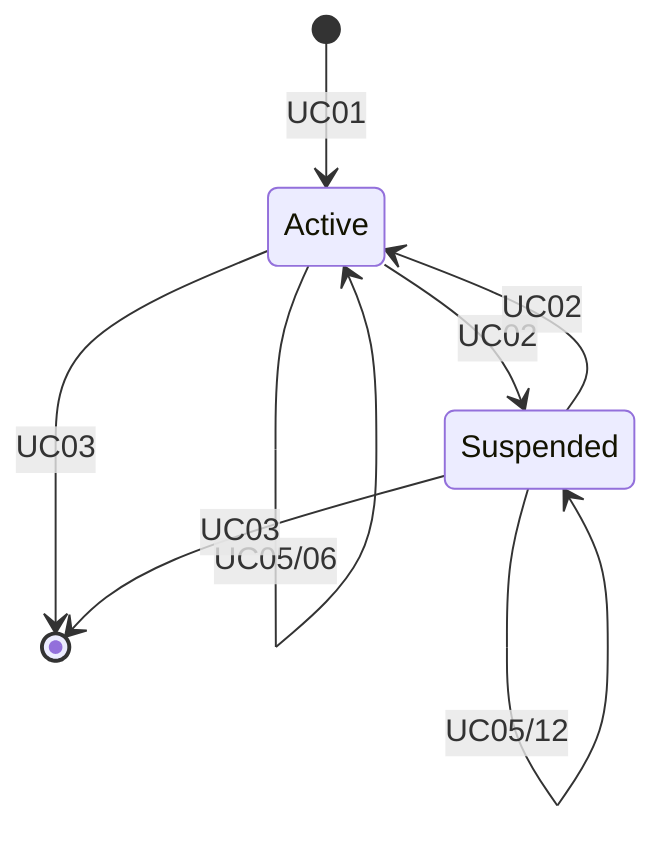

```mermaid
stateDiagram
    [*] --> Active: UC01
    Active --> Active : UC05/06
    Active --> Suspended : UC02
    Suspended --> Active : UC02
    Suspended --> Suspended : UC05/12

    Active --> [*] : UC03
    Suspended --> [*] :UC03
```
