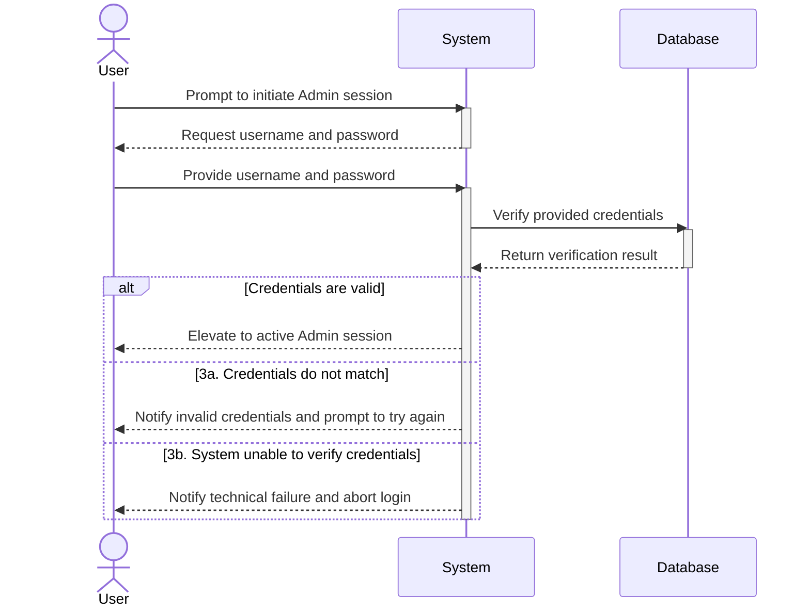

# UC00 - Login as Admin

## Sequence Diagram

| Field                | Description |
|----------------------|-------------|
| **Goal**             | Initiate an active Admin session |
| **Actor**            | User |
| **Pre-conditions**   | No active Admin session exists |
| **Nominal Scenario** | 1. The User prompts the system to initiate an Admin session, and the system requests the username and password. 2. The User provides the username and password. 3. The system verifies the provided credentials with the database. 4. The User is elevated to an active Admin session. |
| **Post-conditions** | The User is authenticated as an Admin. |
| **Exceptions**      | 3a. The credentials do not match: the system notifies the User of invalid credentials and prompts them to try again. 3b. The system is unable to verify the credentials: the system notifies the User of a technical failure and aborts the login. |
