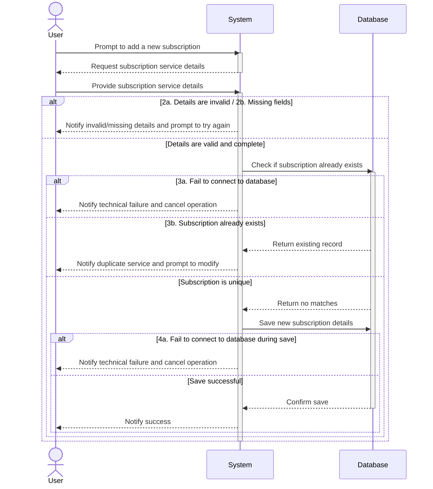

# UC01 - Add New Subscription

## Sequence Diagram

| Field                | Description |
|----------------------|-------------|
| **Goal**             | Add a new subscription service to the database |
| **Actor**            | User |
| **Pre-conditions**   | The User is authenticated and has privileges to add subscriptions |
| **Nominal Scenario** | 1. The User prompts the system to add a new subscription service. 2. The system requests the subscription details. 3. The User provides the details (name, category, base value, billing frequency, last billing date, and necessity level). 4. The system verifies the data and checks the database to ensure the subscription does not already exist. 5. The system saves the information and marks the service as active in the database. |
| **Post-conditions**  | A new subscription has been added to the database. |
| **Exceptions**       | 2a. The provided details are invalid: the User is notified and prompted to try again. 2b. The User is missing required fields: the User is notified and prompted to fill the missing fields. 3a / 4a. The system cannot connect to the database: the User is notified and the operation is cancelled. 3b. A subscription with the provided name already exists: the User is notified of the duplicate and prompted to modify the details. |
