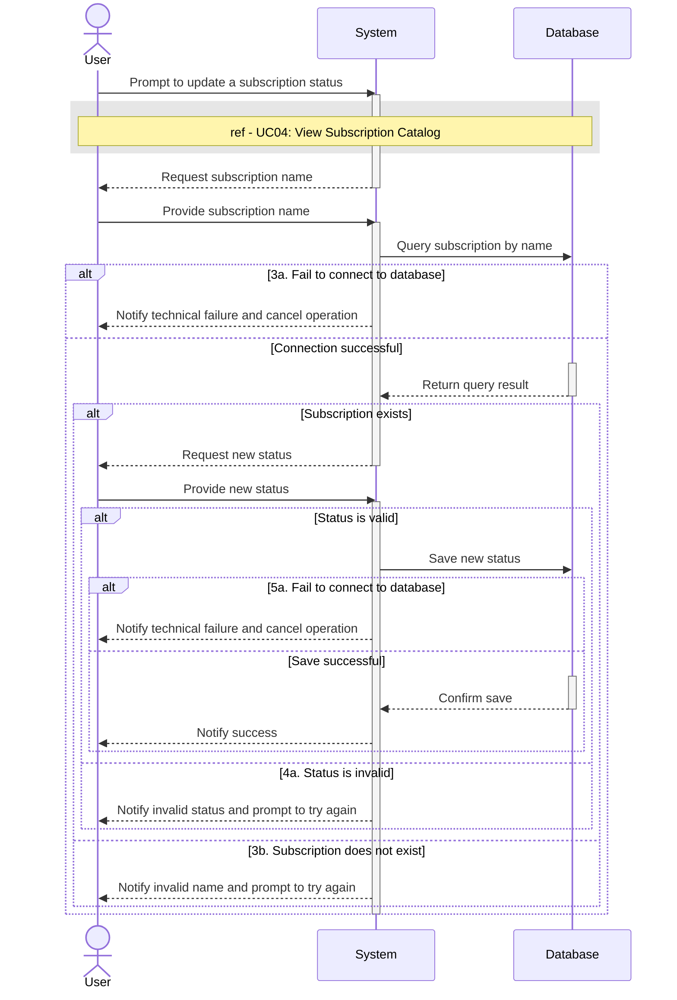

# UC02 - Update Subscription Status

## Sequence Diagram

| Field                | Description |
|----------------------|-------------|
| **Goal**             | Change the subscription status to active or suspended |
| **Actor**            | User |
| **Pre-conditions**   | The User is authenticated and has privileges to update subscriptions |
| **Nominal Scenario** | 1. The User prompts the system to update a subscription status. 2. The system executes UC04: View Subscription Catalog and requests the subscription name. 3. The User provides the name, and the system queries the database to verify its existence. 4. The system requests the new status, and the User provides it. 5. The system validates the status and saves the update to the database. |
| **Post-conditions**  | A subscription's status has been updated. |
| **Exceptions**       | **3a.** The system cannot connect to the database during verification: the User is notified and the operation is cancelled. **3b.** The subscription does not exist: the User is notified and prompted to try again. **4a.** The provided status is invalid: the User is notified and prompted to try again. **5a.** The system cannot connect to the database during the save operation: the User is notified and the operation is cancelled. |
