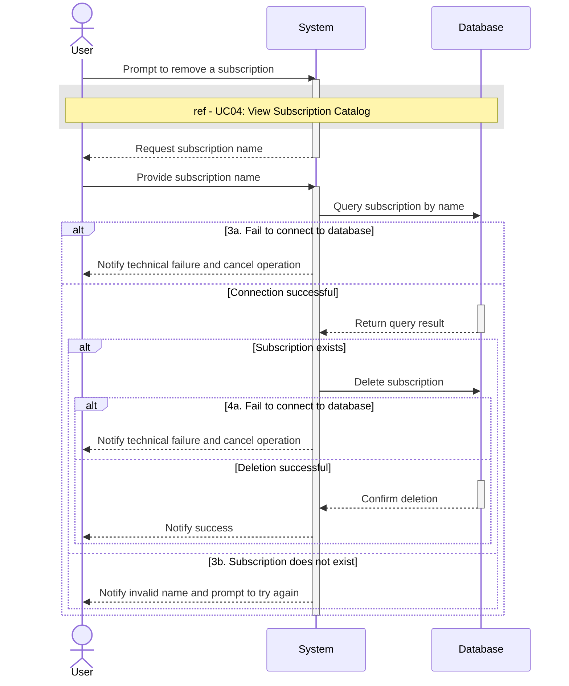

# UC03 - Remove Subscription

## Sequence Diagram

| Field                | Description |
|----------------------|-------------|
| **Goal**             | Remove a subscription service from the database |
| **Actor**            | User |
| **Pre-conditions**   | The User is authenticated and has privileges to remove subscriptions |
| **Nominal Scenario** | 1. The User prompts the system to remove a subscription. 2. The system executes UC04: View Subscription Catalog and requests the subscription name. 3. The User provides the name, and the system queries the database to verify its existence. 4. The system deletes the subscription from the database and notifies the User of success. |
| **Post-conditions**  | A subscription has been permanently removed from the database. |
| **Exceptions**       | 3a. The system cannot connect to the database during verification: the User is notified and the operation is cancelled. 3b. The provided subscription name does not exist: the User is notified and prompted to try again. 4a. The system cannot connect to the database during the delete operation: the User is notified and the operation is cancelled. |
