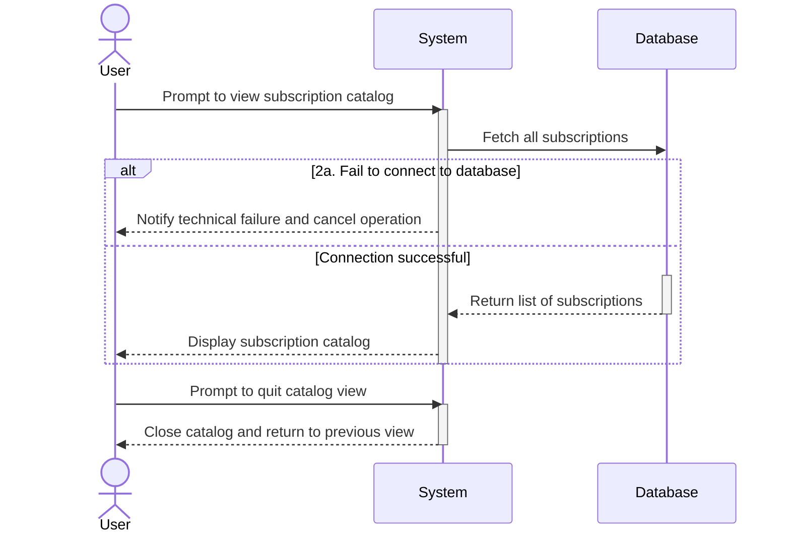

# UC04 - View Subscription Catalog

## Sequence Diagram

| Field                | Description |
|----------------------|-------------|
| **Goal**             | Display every subscription present in the database |
| **Actor**            | User |
| **Pre-conditions**   | The User is authenticated |
| **Nominal Scenario** | 1. The User prompts the system to view the subscription catalog. 2. The system queries the database for all subscriptions. 3. The system displays the subscription catalog to the User. 4. The User prompts to quit the catalog view, and the system closes the catalog. |
| **Post-conditions**  | The User has viewed the subscription catalog. |
| **Exceptions**       | 2a. The system cannot connect to the database: the User is notified and the operation is cancelled. |
