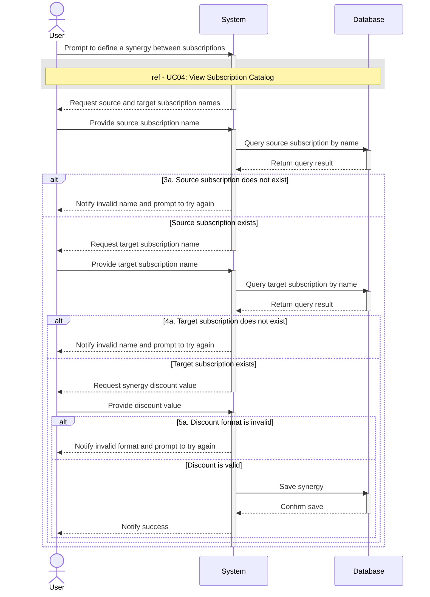

# UC05 - Define Synergy Between Subscriptions 

## Sequence Diagram

| Field                | Description |
|----------------------|-------------|
| **Goal**             | Establishes a relation between two different subscription services |
| **Actor**            | User        |
| **Pre-conditions**   | Having the application running |
| **Nominal Scenario** | 1. The User prompts the system to establish a relation between two subscription services 2.The system executes the View Subscription Catalog use case to display the active subscriptions 3. The User writes the name of the subscription service that causes a synergy 4.The User writes the name of the subscription service that benefits from the first subscription service 5. The User adds the discount associated, which can be a flat value or a percentage 6. The system saves the information to the database |
| **Post-conditions**  | A synergy between two subscription services is added|
| **Exceptions**       | 3a. The prompted subscription service does not exist in the database: the user is notified and the User is prompted to try again 4a. The prompted subscription service does not exist in the database: the user is notified and the User is prompted to try again 5a.The discount has an invalid format: the User is notified and prompted to try again 6a.The system cannot connect to the database: the user is notified and the operation is cancelled.|
