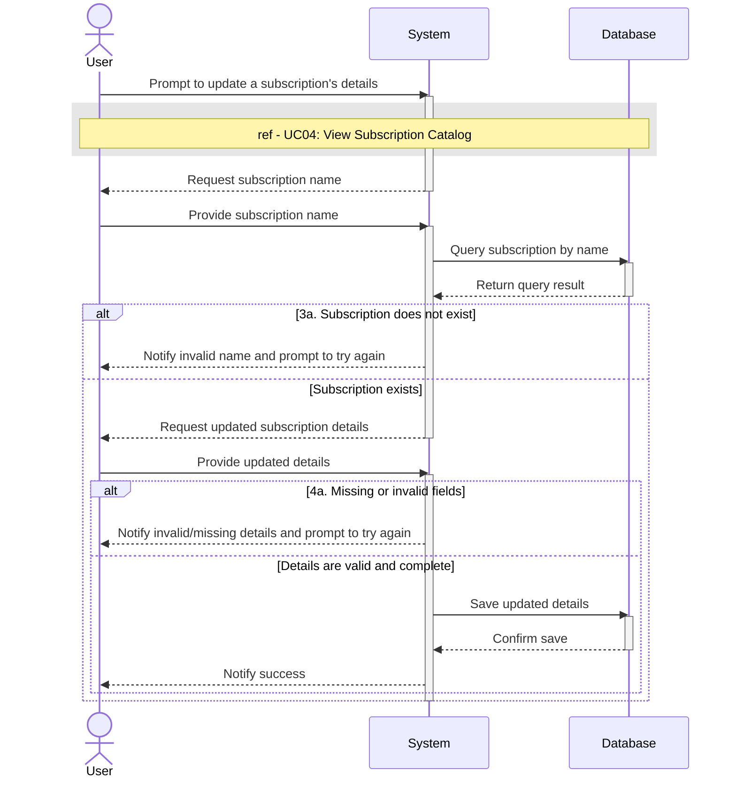

# UC06 - Update Subscription Details

## Sequence Diagram

| Field                | Description |
|----------------------|-------------|
| **Goal**             | Update details of a given subscription service in the database |
| **Actor**            | User        |
| **Pre-conditions**   | Having the application running |
| **Nominal Scenario** | 1. The User prompts the system to update the details of a subscription service 2.The system executes the View Subscription Catalog use case to display the active subscriptions 3. The User writes the name of the desired subscription service to update it's details 4. The User provides the subscription details (name, category, base value, billing frequency, last billing date and necessity level) 5. The system saves the information to the database |
| **Post-conditions**  | The User has altered a subscription service's details |
| **Exceptions**       | 2a. The system cannot connectto the database: the User is notified and the operation is cancelled 3a. The subscription service name provided does not exist or is invalid: the User is notified and prompted to try again 4a. The User does not add every detail field: the User is notified and prompted to fill the missing fields  5a. The system cannot connect to the database: the User is notified and the operation is cancelled. |
