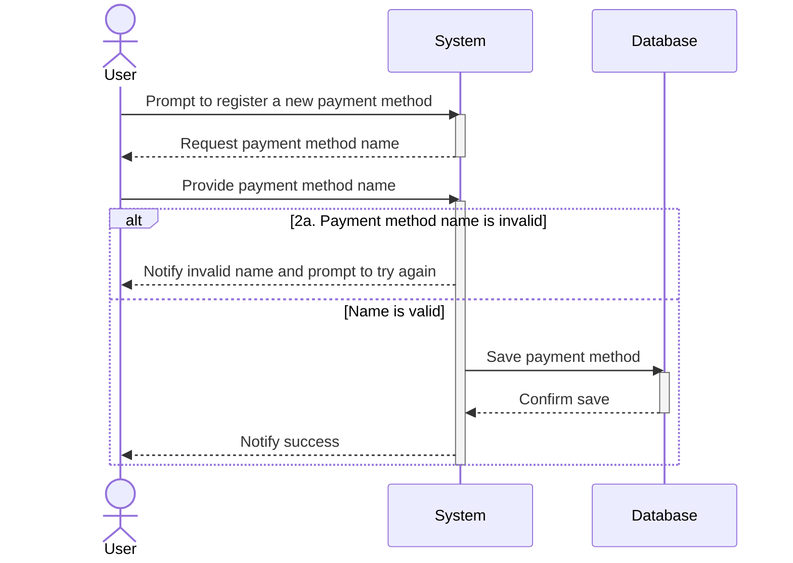

# UC07 - Register Payment Method

## Sequence Diagram

| Field                | Description |
|----------------------|-------------|
| **Goal**             | Register a new payment method to be used when logging in a payment |
| **Actor**            | User        |
| **Pre-conditions**   | 1. Having the application running 2. May be triggered from UC08 if the User wants to register a new payment method during a payment log |
| **Nominal Scenario** | 1. The User prompts the system to add a new payment method 2. The User writes the name of the new payment method 3. The system saves the information to the database |
| **Post-conditions**  | A new payment method has been added to the list of possible payment methods |
| **Exceptions**       | 2a. The payment method name provided is invalid: the User is notified and prompted to try again 3a. The system cannot connect to the database: the User is notified and the operation is cancelled  |
