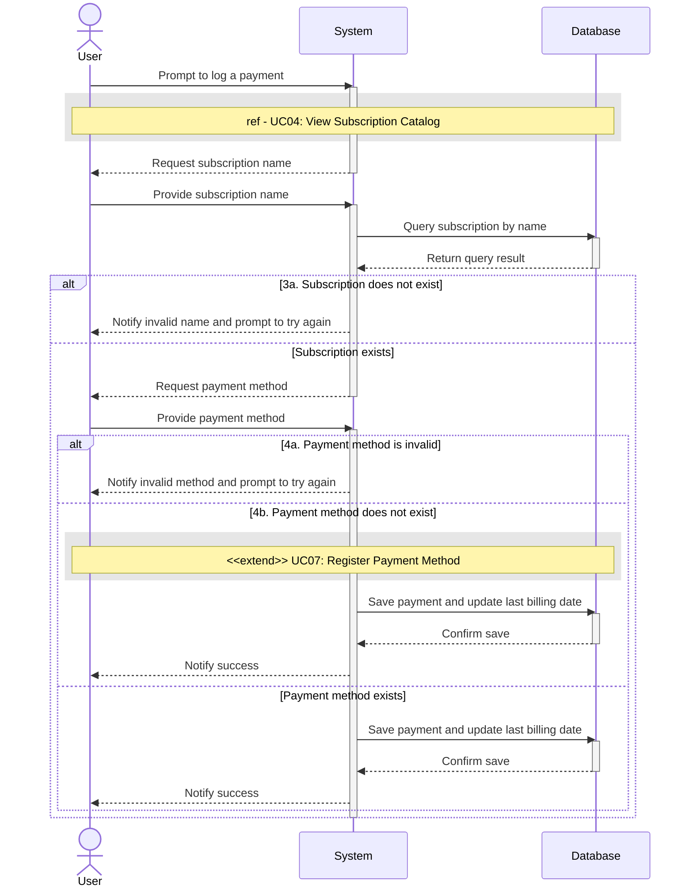

# UC08 - Log Payment

## Sequence Diagram

| Field                | Description |
|----------------------|-------------|
| **Goal**             | Register a new payment for a subscription service |
| **Actor**            | User        |
| **Pre-conditions**   | Having the application running |
| **Nominal Scenario** | 1. The User prompts the system to register a new payment for a subscription service 2. The system executes the View Subscription Catalog use case to display the active subscriptions 3. The User selects the subscription service for which to register a payment 4. The User selects the payment method used for the payment  \<\<extend\>\> [if new payment method needed]: UC07 - Register Payment Method 5. The system saves the information to the database and updates the subscription's last billing day |
| **Post-conditions**  | A new payment has been added to the log list of previous payments and the subscription's last billing day has been updated |
| **Exceptions**       | 3a. The subscription service name provided does no exist in the database or is invalid: the User is notified and prompted to try again 4a. The payment method provided is invalid: the User is notified and prompted to try again 5a. The system cannot connect to the database: the User is notified and the operation is cancelled  |
