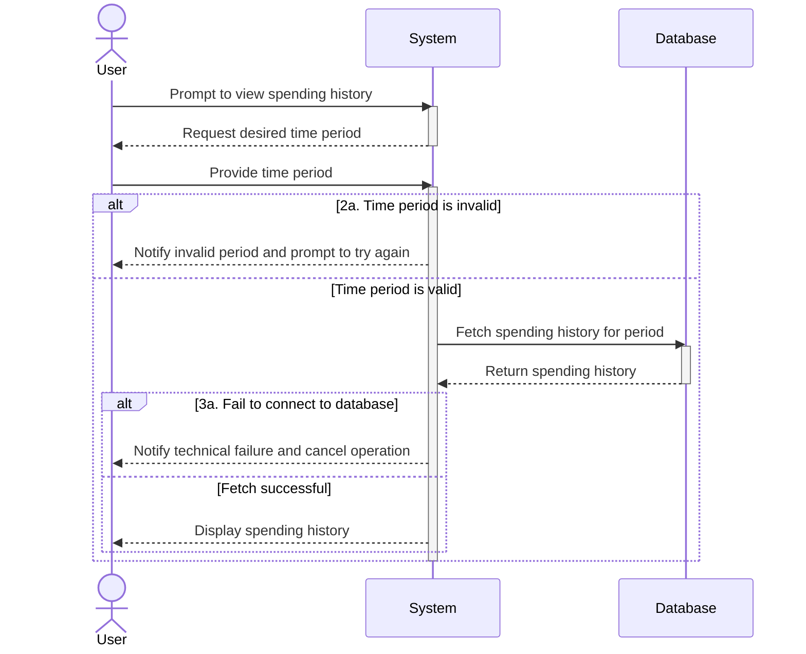

# UC09 - View Spending History

## Sequence Diagram

| Field                | Description |
|----------------------|-------------|
| **Goal**             | View the spending history over a determined period of time |
| **Actor**            | User        |
| **Pre-conditions**   | Having the application running |
| **Nominal Scenario** | 1. The User prompts the system to see the spending history 2. The User prompts the desired time period 3. The system retrieves and displays the spending history for the selected time period |
| **Post-conditions**  | The spending history for the selected time period has been displayed |
| **Exceptions**       | 2a. The given period of time is invalid: the User is notified and prompted to try again 3a. The system cannot connect to the database: the User is notified and the operation is cancelled |
