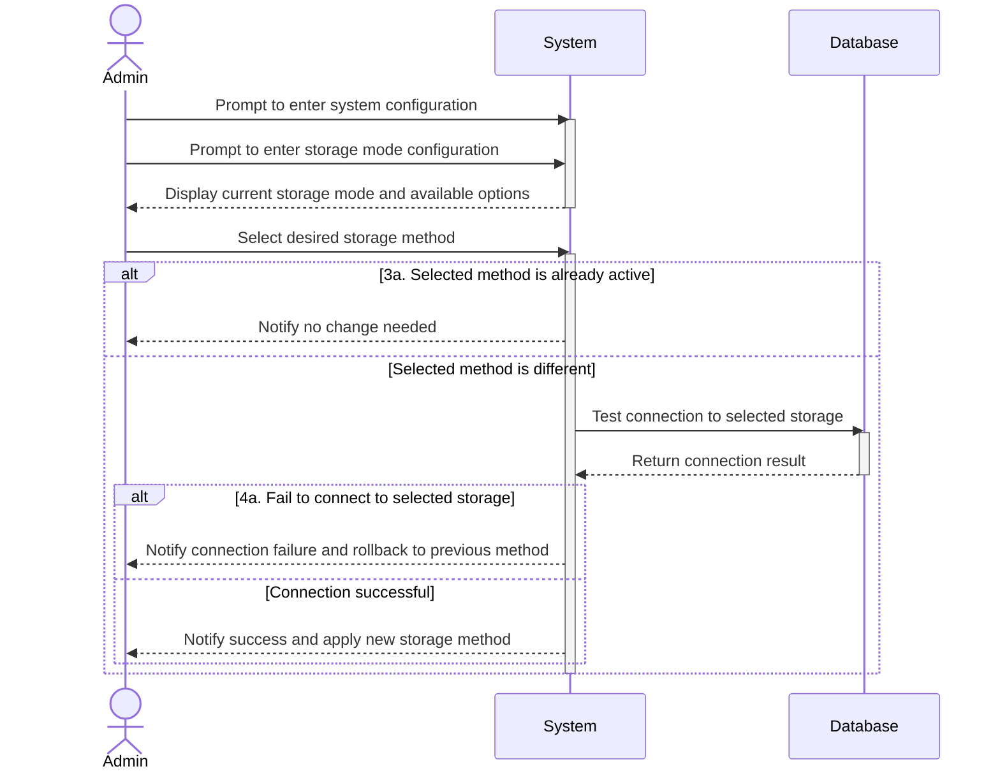

# UC10 - Modify Storage Mode

## Sequence Diagrams

| Field                | Description |
|----------------------|-------------|
| **Goal**             | Alternate between storing data into a PostgreSQL database or a JSON file             |
| **Actor**            | Admin       |
| **Pre-conditions**   | Having an active Admin session |
| **Nominal Scenario** | 1. The Admin prompts to enter the system configuration   2. The Admin prompts to enter storage mode configuration   3. The Admin chooses the desired storage method   4. The system applies and saves the configuration.|
| **Post-conditions**  | The storage method is upadted and persisted |
| **Exceptions**       | 3a. The data storage method is already selected: the Admin is notified and no change is made   4a. Fail to connect to the selected database: the system rollsback to the previous method and notifies the Admin about the failure|
