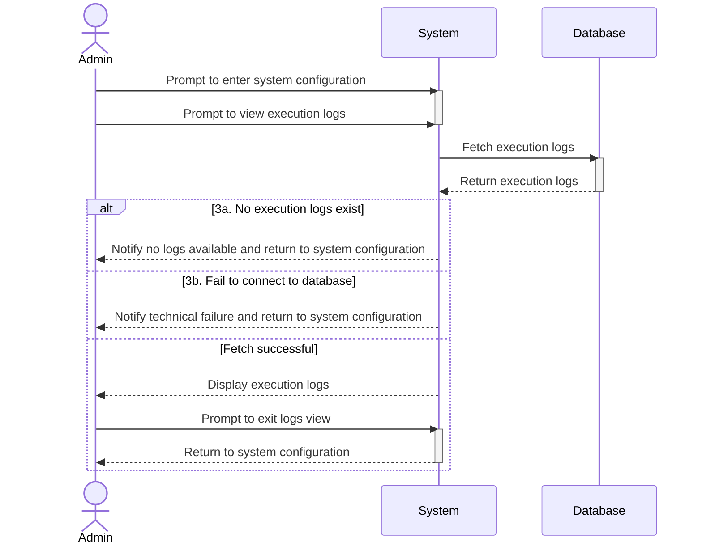

# UC11 - View Execution Logs

## Sequence Diagram

| Field                | Description |
|----------------------|-------------|
| **Goal**             | View the system's execution logs |
| **Actor**            | Admin |
| **Pre-conditions**   | Having an active Admin session|
| **Nominal Scenario** | 1. The Admin prompts to enter system configuration 2. The Admin prompts to be shown the execution logs 3. The system prints the execution logs on the terminal 4. The Admin exits the logs view and returns to the system configuration page |
| **Post-conditions**  | The execution logs are printed on the terminal |
| **Exceptions**       | 3a. There are no execution logs: the Admin is notified and the interface rollsback to the system configuration page  3b. The system cannot fetch the execution logs: the Admin gets notified of the error and the interface rollsback to the system configuration page|
