# UC12 - Filter/Sort Subscription Catalog

## Sequence Diagram

```mermaid
sequenceDiagram
    actor User
    participant System
    participant Database

    rect rgb(230, 230, 230)
        Note over User,Database: ref - UC04: View Subscription Catalog
    end

    User->>System: Prompt to filter or sort the catalog
    activate System
    System-->>User: Request filter or sorting criteria
    deactivate System

    User->>System: Provide criteria
    activate System

    alt 2a. Criteria is invalid
        System-->>User: Notify invalid criteria and prompt to try again
    else Criteria is valid
        System->>Database: Fetch catalog with provided criteria
        activate Database
        Database-->>System: Return filtered/sorted catalog
        deactivate Database

        alt 3a. Fail to connect to database
            System-->>User: Notify failure and display unfiltered catalog
        else Fetch successful
            System-->>User: Display filtered/sorted catalog
        end
    end
    deactivate System
```

| Field                | Description |
|----------------------|-------------|
| **Goal**             | Filter or sort the subscription catalog to improve navigation |
| **Actor**            | None (triggered exclusively via <<extend>> from UC04) |
| **Pre-conditions**   | The subscription catalog is being displayed |
| **Nominal Scenario** | 1. The User prompts the system to filter or sort the catalog 2. The User provides the desired filter or sorting criteria 3. The system retrieves and displays the catalog according to the provided criteria |
| **Post-conditions**  | The subscription catalog has been displayed according to the selected criteria |
| **Exceptions**       | 2a. The provided criteria is invalid: the system notifies the User and prompts them to try again 3a. The system cannot retrieve the filtered or sorted catalog: the system notifies the User and displays the unfiltered catalog |
